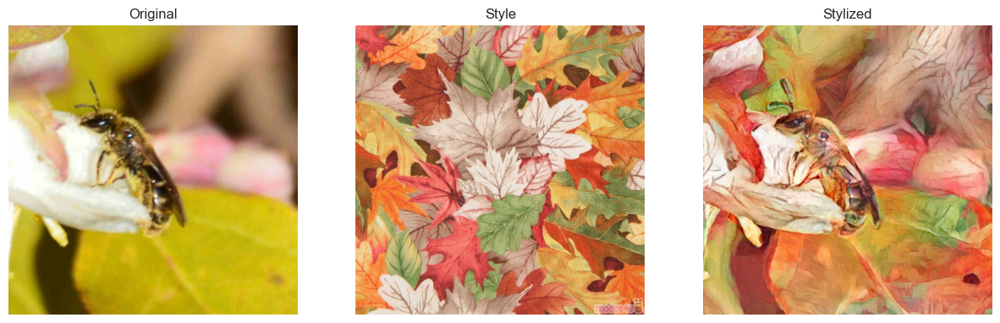
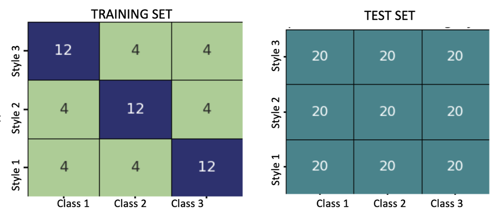

# Starting kit for STYLE-TRANS-FAIR Challenge

This challenge uses a Dataset from **[Meta Album](https://meta-album.github.io/)**

---

# Introduction

This challenge uses a Dataset from ***Meta Album***.

This challenge's task is image classification, but using [Neural Style Transfered](https://en.wikipedia.org/wiki/Neural_style_transfer) images instead of original one. Here is a demo of an Apoidea:

- The first image on the left is its original image
- The middle image is the painting style we are using for this image
- The image on the right is the result of [Neural Style Transfer](https://en.wikipedia.org/wiki/Neural_style_transfer), and we need to classify this image as an Apoidea

There are 5 tasks in the Development phase and 5 tasks in the Final Phase.
Each task in the dataset consists of **360** images splited into 9 groups:

where the training set is biased in Style, and the test set is balanced.

The sample dataset in this starting kit conists of **360** images of the Insect classification task.

This challenge is about creating a Machine Learning model and train it with the data provided to classify the images into the mentioned 3 Classes without being biased towards Styles.

### Phases

This challenge conists of two phases:

1. `Development Phase`
   In this phase you can train a model and submit at most 20 submissions per day to check the score of your model and to see how good your model is performing. Once you are satisfied with your performance then you can try the Final Phase.
2. `Final Phase`
   In this phase you can submit only once so it is advised to do it when you are ready for the final submission.

**References and credits:**

- Meta Album (https://meta-album.github.io/)
- Université Paris Saclay (https://www.universite-paris-saclay.fr/)
- ChaLearn (http://www.chalearn.org/)

---

### Prerequisites:

Install Anaconda Python 3.8

### Usage:

- The file [README.ipynb](./README.ipynb) contains step-by-step instructions on how to create a sample submission for the Bees and Wasps Image Classification challenge.
  At the prompt type:
  jupyter-notebook README.ipynb
- modify sample_code_submission to provide a better model or you can also write your own model in the jupyter notebook.
- zip the contents of sample_code_submission (without the directory, but with metadata), or
- download the public_data and run (double check you are running the correct version of python):

  `python ingestion_program/ingestion.py public_data sample_result_submission ingestion_program sample_code_submission`
- zip the contents of sample_result_submission (without the directory).
