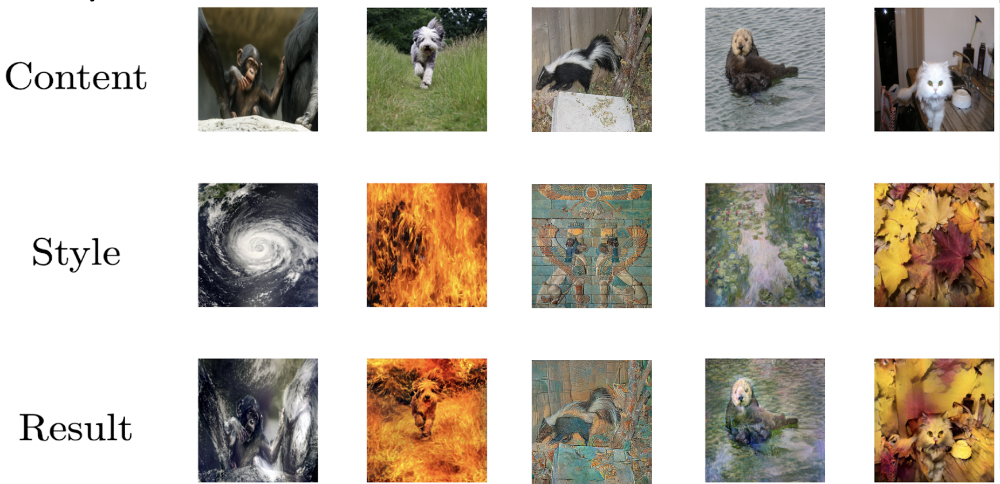
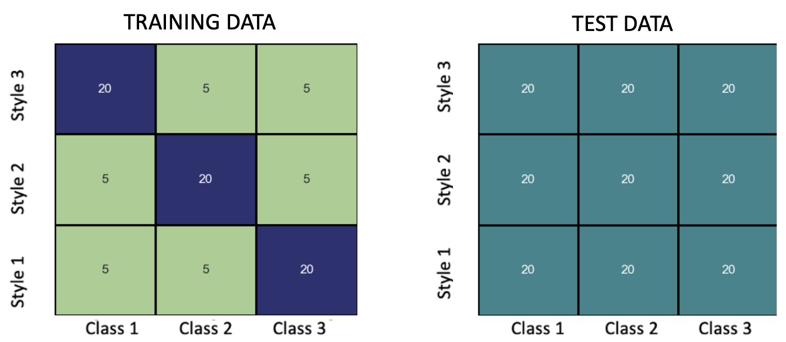
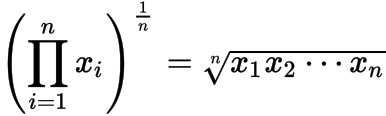

# Starting kit for STYLE-TRANS-FAIR Challenge

---

# Introduction

### Overview

Over the past few years, society has been grappling with the extent to which human biases can be incorporated into artificial intelligence systems, leading to harmful consequences. With the proliferation of big data, optimizing AI systems solely for performance will not only fail to improve real-world applications, but also increase the risk of bias in ways that may not be immediately apparent.

Many datasets are plagued by bias. For instance, background is a big source of bias in image datasets (e.g planes usually have sky backgrounds, boats usually have water backgrounds, etc) which causes machine learning models to learn its noise (e.g classify all sky backgrounds as planes, or all water backgrounds as boats, etc).
To mimic this effect, we introduce a creative way to add controlled bias into the dataset, which is called Neural Style Transfer. This method can be generalized to all kinds of domains and also requires little to no manual work when creating synthetic images.

### Main goal of this competition

The goal of this challenge is to perform multi-task classification with a training dataset biased towards Styles. You will need to make sure it performs well on an unbiased test dataset. More info can be found in Data tab.

# Data

### Neural Style Transfer

To understand the competition, first let's understand [Neural Style Transfer](https://en.wikipedia.org/wiki/Neural_style_transfer).

[Neural Style Transfer](https://en.wikipedia.org/wiki/Neural_style_transfer) is a process of **"FUSING"** a content image with a style image to get the result as shown:

This challenge uses a Dataset from **[Meta Album](https://meta-album.github.io/).**

### Task

This challenge's task is image classification, but using [Neural Style Transfered](https://en.wikipedia.org/wiki/Neural_style_transfer) images instead of original one. Here is a demo of an Apoidea:

- The first image on the left is its original image
- The middle image is the painting style we are using for this image
- The image on the right is the result of [Neural Style Transfer](https://en.wikipedia.org/wiki/Neural_style_transfer), and we need to classify this image as an Apoidea

There are approximately 200 tasks in the Development phase and 200 tasks in the Final Phase.
Each task in the dataset consists of **360** images splited into 9 groups:

where the training set is biased in Style, and the test set is balanced.

The sample dataset in this starting kit conists of **360** images of the Insect classification task.

### Data description

Each task is composed of:

- A labels.csv file composed of the following columns:

  + "ORIG_CATEGORY_FILE" is the **file used** for the construction of the **category** of the image
  + "CATEGORY" is the **name of the insect category** of the image
  + "ORIG_STYLE_FILE" is the **file used** for the construction of the **style of the image**
  + "STYLE" is the name of the **style used** to build the image
  + "FILE_NAME" is the **name of the image**
  + "label_cat" is the **label** of the image (the category)
- A "content" folder containing the **content** **images** used to build the final images
- A "styles" folder containing the **style images** used to build the final images
- A "stylized" folder containing the **stylized images** obtained using the [Neural Style Transfer](https://en.wikipedia.org/wiki/Neural_style_transfer) technique. These are the images we want to predict the class.

# Evaluation

### Phases

This challenge conists of two phases:

1. `Development Phase`
   In this phase you can train a model and submit at most 5 submissions per day to check the score of your model and to see how good your model is performing. We provide you with labeled training data and unlabeled test data. Train your model on the training data and submit your model's predictions on codabench (The end of the "readme.ipynb" file of the starting kit gives you an example to create a submission). Your performance will be displayed on the leaderboard.Once you are satisfied with your performance then you can try the Final Phase
2. `Final Phase`
   In this phase you can submit **only once** so it is advised to do it when you are ready for the final submission. Your performance on the test set will be displayed on the final leaderboard.In this phase you can submit only once so it is advised to do it when you are ready for the final submission

### Metrics

The metrics used for this challenge is the geometric mean accuracy. For each group with the same style and class, an accuracy score is computed. The final output corresponds to the geometric mean of those accuracies.

<i>Geometric mean formula</i>

---

# Prerequisites

Install Anaconda and create an environment with Python 3.8 (RECOMMENDED)

### Usage:

- The file [README.ipynb](./README.ipynb) contains step-by-step instructions on how to create a sample submission for the Bees and Wasps Image Classification challenge.
  At the prompt type:
  jupyter-notebook README.ipynb
- modify sample_code_submission to provide a better model or you can also write your own model in the jupyter notebook.
- zip the contents of sample_code_submission (without the directory, but with metadata), or
- download the public_data and run (double check you are running the correct version of python):

  `python ingestion_program/ingestion.py public_data sample_result_submission ingestion_program sample_code_submission`
- zip the contents of sample_result_submission (without the directory).

# References and credits

- Meta Album (https://meta-album.github.io/)
- Université Paris Saclay (https://www.universite-paris-saclay.fr/)
- ChaLearn (http://www.chalearn.org/)
